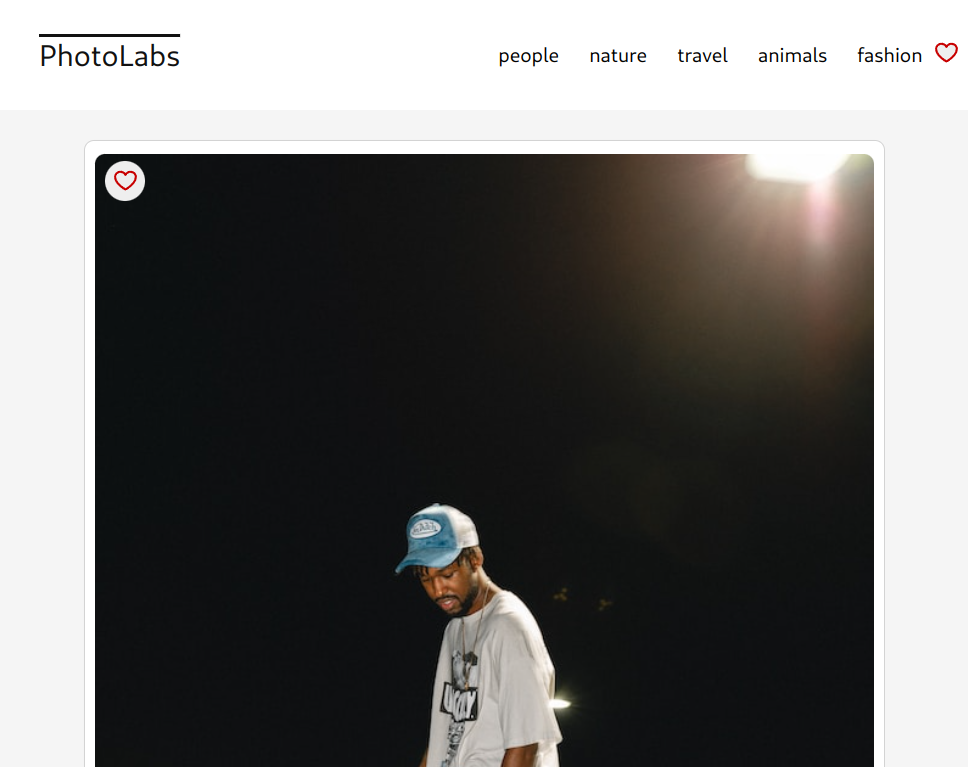

# Photolabs

A web gallery application 

## Screenshots



## Setup

Install dependencies with `npm install` in each respective `/frontend` and `/backend`.


## [Backend] Running Backend Servier

This will be required to have photos show 

Read `backend/readme` for further setup details.

```sh
cd backend
npm start
```

## [Frontend] Running Webpack Development Server

```sh
cd frontend
npm start
```

For development direct your browser to http://localhost:3000


