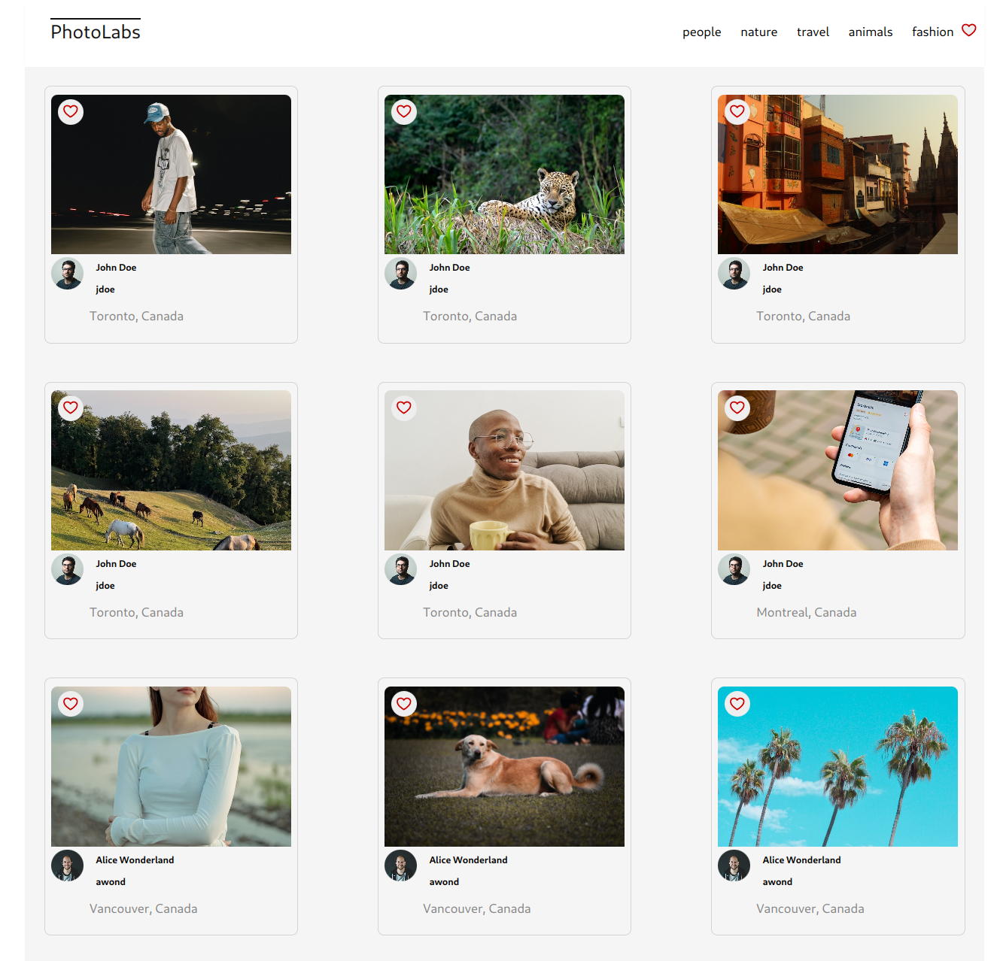

# Photolabs

A web gallery application 

## Screenshots



## Dependencies and Setup

For setup this project requires
- Nodejs 16.13.2+ , and NPM 8.1.2+
- postgres 14+

Further dependencies are installed with 
 with `npm install` in each respective `/frontend` and `/backend` directories.

To fully test the application - both the frontend and backend of the 
application will need to be run.

## on *Nix systems

Bash scripts start_app.sh and stop_app.sh have been provided 
to quickly start and halt the application. 
Requires bash.

## [Backend] Running Backend Servier

This will be required to have photos show 

Read `backend/readme` for further setup details.
Postgres database server will need to be setup to fully configure this

```sh
cd backend
npm start
```

Dependencies
- (included in package.json)
- body-parser
- cors 
- dotenv
- express 
- helmet
- socket.io
- ws
- pg    - postgress adapter

## [Frontend] Running Webpack Development Server

```sh
cd frontend
npm start
```

For development direct your browser to http://localhost:3000

Dependencies:
- (included in package.json)
- React, react-dom, react-scripts - frontend UI library
- web-vitals
- jest-dom
- user-event


